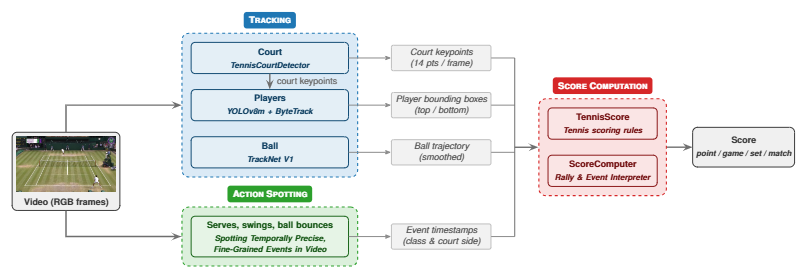

# Automatic Tennis Score Computation

> **Course project** — ELEN0449-1 Computer Vision Understanding  
> Montefiore Institute, University of Liège  
> Emilien de la Brassinne Bonardeaux · Arthur de Landsheere · Yanis Geurts

## Overview

This repository contains the implementation of an end-to-end monocular pipeline for **automatic tennis score computation from raw video footage**, requiring no specialized infrastructure beyond a single broadcast-style camera.

The pipeline takes an untrimmed tennis match video as input and outputs a structured match score (point, game, set, and match level) by combining three offline modules:

1. **Tracking** — extracts per-frame spatial information about court geometry, player positions, and ball trajectory.
2. **Action Spotting** — temporally localizes serves, bounces, and swings throughout the match (6 event classes).
3. **Score Computation** — consumes the outputs of the two modules above and applies official tennis rules to reconstruct the full match score.

## Repository Structure

## 1. [Tracking](/Tracking/)

This folder contains the **tracking component** of our automatic tennis scoring pipeline:

1. **Player detection & tracking** — YOLOv8m (pretrained on COCO) + ByteTrack
2. **Court-line detection** — TennisCourtDetector [yastrebksv/TennisCourtDetector](https://github.com/yastrebksv/TennisCourtDetector): DL model with basic CV postprocessing steps.
3. **Ball tracking** — TrackNet V1 ([yastrebksv/TrackNet](https://github.com/yastrebksv/TrackNet)) wrapped in a batched sliding-window inference loop (fixes the OOM in the reference repo)

Look at the [README](/Tracking/README.md) file in the Tracking folder for details about the setup.

## 2. [Action Spotting](/Action-Spotting/)

For the Action Spotting task, we make use of the [Spotting Temporally Precise, Fine-Grained Events in Video](https://github.com/jhong93/spot) Github repository. Look at the [README](/Action-Spotting/README.md) file in the Action Spotting folder for details about the setup.

## 3. [Score Computation](/Score/)

This folder contains the **score computation component** of our automatic tennis scoring pipeline. Look at the [README](/Score/README.md) file in the Score folder for details about the setup.

